# Alumni

## Ph.D. graduates

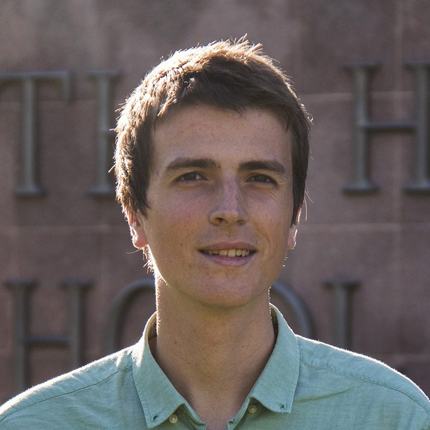{: width="110"}

**Jordi Ventura Siches**, PhD 2025\\
International Centre for Numerical Methods in Engineering (CIMNE), Barcelona, Spain

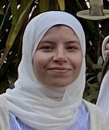{: width="110"}

**Asmaa Eldesoukey**, PhD 2025\\
Postdoctoral fellow, Iowa State University

{: width="110"}

**Olga Movilla Miangolarra**, PhD 2023\\
Universidad de La Laguna, Spain

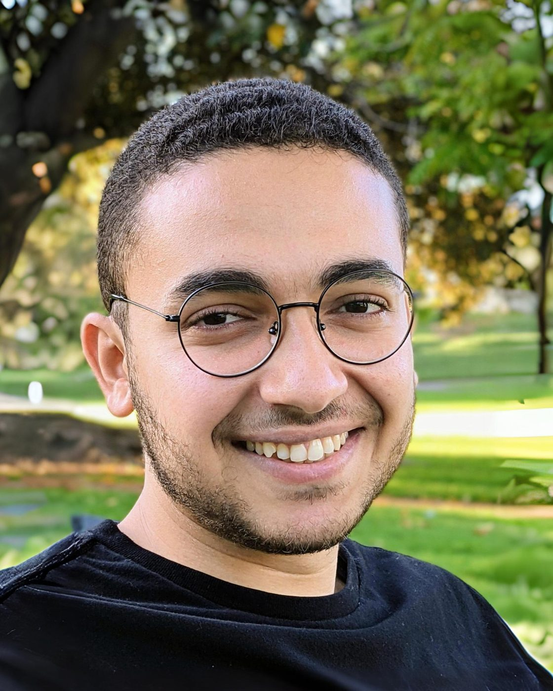{: width="110"}

**Mahmoud Abdelgalil**, PhD 2023 (co-advised)\\
University at Buffalo

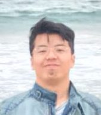{: width="110"}

**[Anqi Dong](https://sites.google.com/view/anqidong)**, PhD 2023\\
Royal Institute of Technology (KTH), Stockholm, Sweden

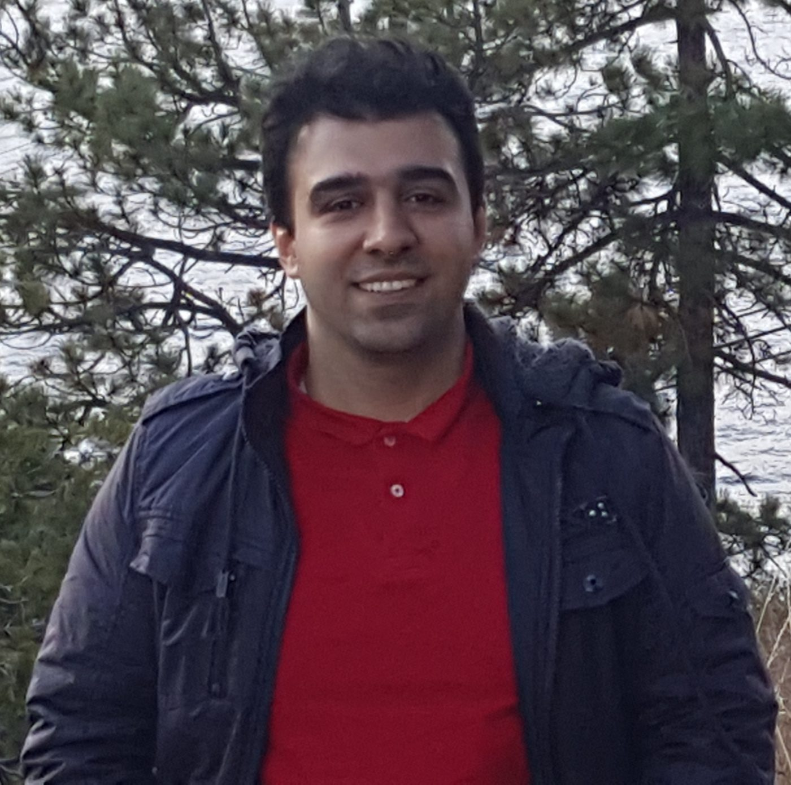{: width="110"}

**[Amirhossein Karimi](https://sites.google.com/uci.edu/amirkarimi)**, PhD 2022\\
First American Financial Corp.

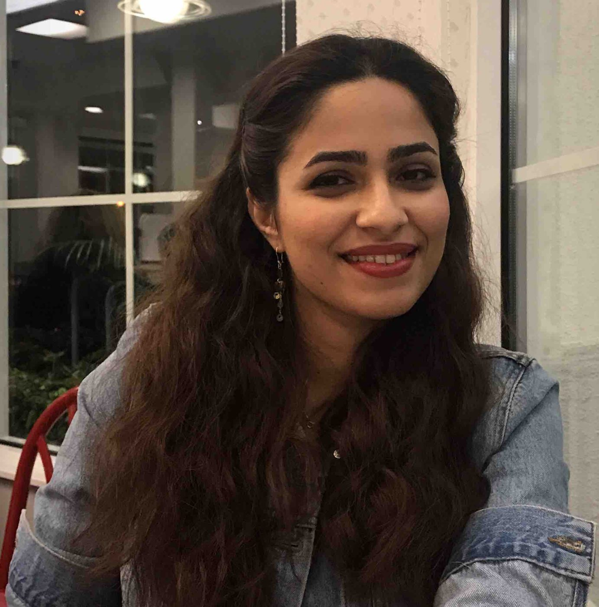{: width="110"}

**[Zahra Askarzadeh](https://www.linkedin.com/in/zahra6/)**, PhD 2021\\
Meta

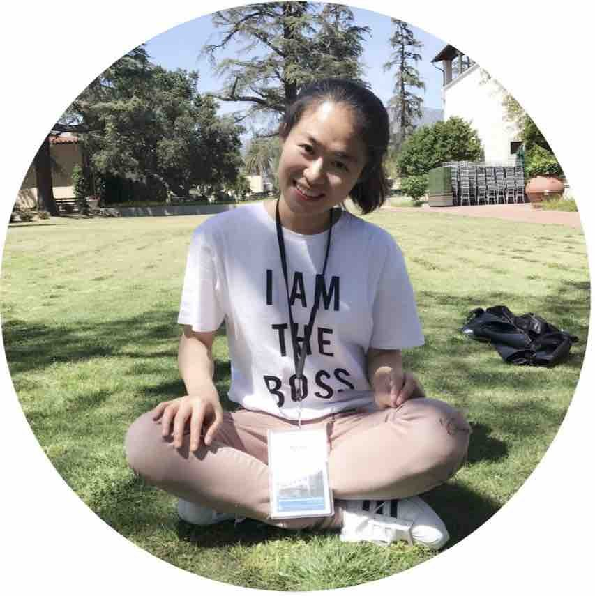{: width="110"}

**[Rui Fu](https://cacso.nju.edu.cn/8b/85/c55864a691077/page.htm)**, PhD 2020\\
Nanjing University, China

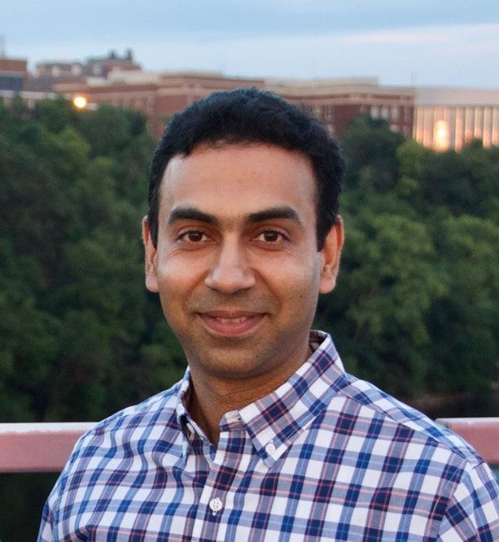{: width="110"}

**[Hamza Farooq](https://experts.umn.edu/en/persons/hamza-farooq)**, PhD 2017\\
University of Minnesota, Twin Cities

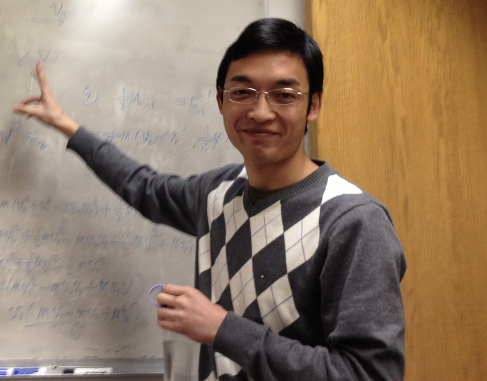{: width="110"}

**[Yongxin Chen](https://yongxin.ae.gatech.edu)**, PhD 2016\\
Georgia Tech, Atlanta

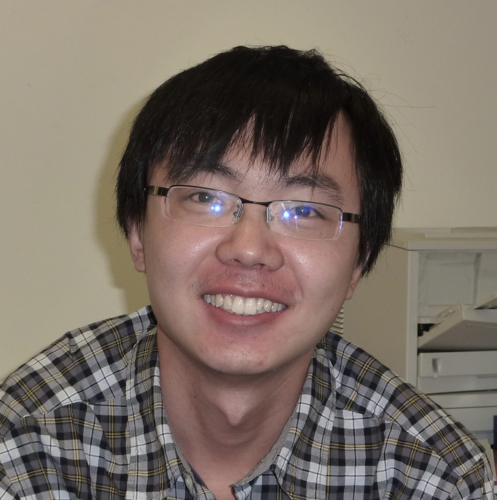{: width="110"}

**[Lipeng Ning](https://pnl.bwh.harvard.edu/index.php/lipeng-ning-ph-d/)**, PhD 2013\\
Harvard, Boston

[Xianhua Jiang](https://www.linkedin.com/in/xianhua-jiang-7a6364101), PhD 2012 — Starkey Technologies, Minnesota\\
[Shahrouz Mir Takyar](https://www.linkedin.com/in/shahrouztakyar), PhD 2012 — Uber, San Francisco\\
[Gerald Mtatifikolo](https://ca.linkedin.com/in/gerald-mtatifikolo-bb0bb77), PhD 2007 — August Electronics, Alberta\\
[Ali Nasiri Amini](https://scholar.google.com/citations?user=ov6Oz88AAAAJ&hl=en&oi=sra), PhD 2005 — Google\\
[Subbarao Varigonda](https://www.researchgate.net/profile/Subbarao_Varigonda), PhD 2001 — Carrier Corp.\\
[Ian Fialho](https://www.linkedin.com/in/ian-fialho-0ab46b55), PhD 1997 — Boeing\\
[Chin Chang](https://www.linkedin.com/in/chin-chang-34719619), PhD 1993 — Semtech Corp., California\\
[Craig Shankwitz](https://westerntransportationinstitute.org/wti_people/craig-shankwitz/), PhD 1992 — Montana State University

## Postdoctoral advisees

{: width="110"}

**Asmaa Eldesoukey**, 2025–2026\\
Iowa State University

{: width="110"}

**Olga Movilla Miangolarra**, 2023–2024\\
Universidad de La Laguna, Spain

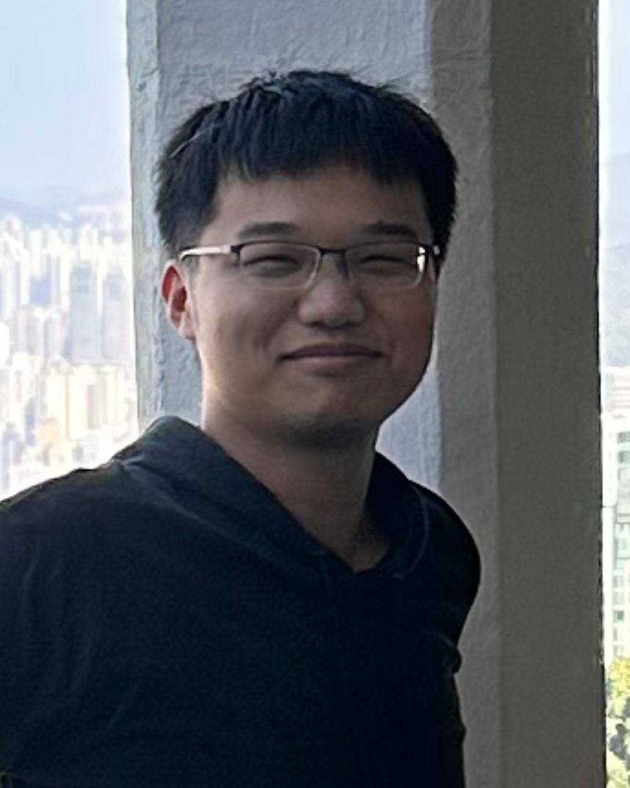{: width="110"}

**Wuwei Wu**\\
City University of Hong Kong

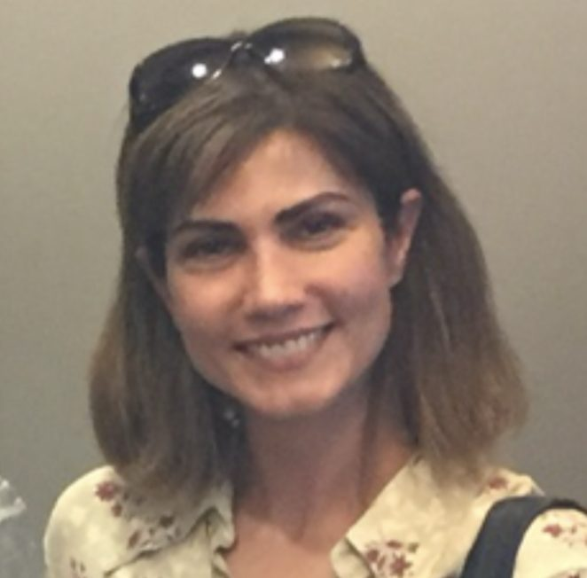{: width="110"}

**Fariba Ariaei**, 2019–2022\\
UC Irvine and CSU Long Beach

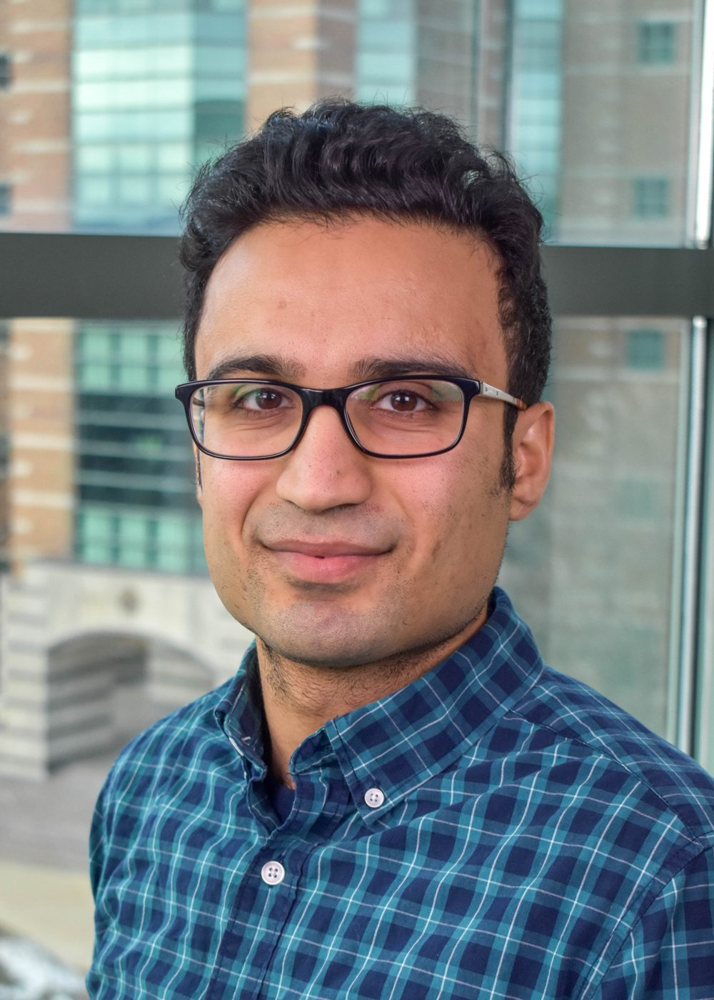{: width="110"}

**[Amirhossein Taghvaei](https://publish.illinois.edu/amirtaghvaei/)**, 2019–2021\\
University of Washington, Seattle

{: width="110"}

**Rui Fu**, 2020–2021\\
Nanjing University, China

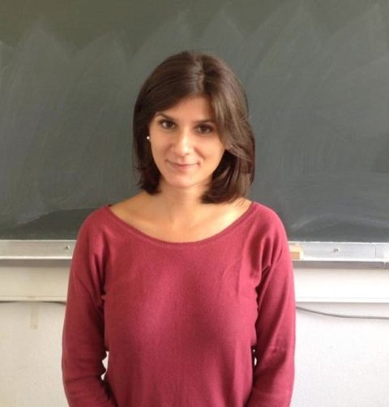{: width="110"}

**Luigia Ripani**, 2017–2018\\
Crédit Agricole Assurances, France

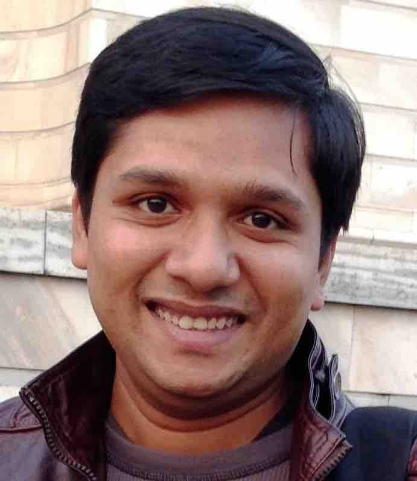{: width="110"}

**[Abhishek Halder](https://www.soe.ucsc.edu/people/ahalder)**, 2016–2017\\
Iowa State University

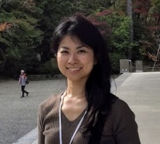{: width="110"}

**[Kaoru Yamamoto](https://sites.google.com/site/kaoruyamamotoweb/)**, 2015–2016\\
Kyushu University

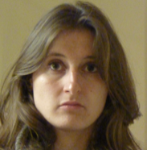{: width="110"}

**[Francesca Carli](http://www-control.eng.cam.ac.uk/Main/FrancescaCarli)**, 2013–2014\\
University of Cambridge, UK

## Visiting scholars

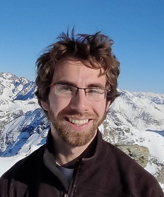{: width="110"}

**[Matthieu Dolbeault](https://sites.google.com/view/matthieu-dolbeault/home)**, 2018

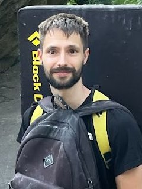{: width="110"}

**[Arthur Stephanovitch](https://sites.google.com/view/arthur-stephanovitch/)**, 2022

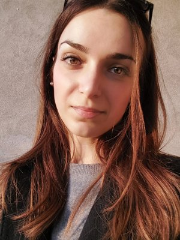{: width="110"}

**[Valentina Ciccone](https://sites.google.com/view/valentina-ciccone/home-page)**, 2019

## M.S. students

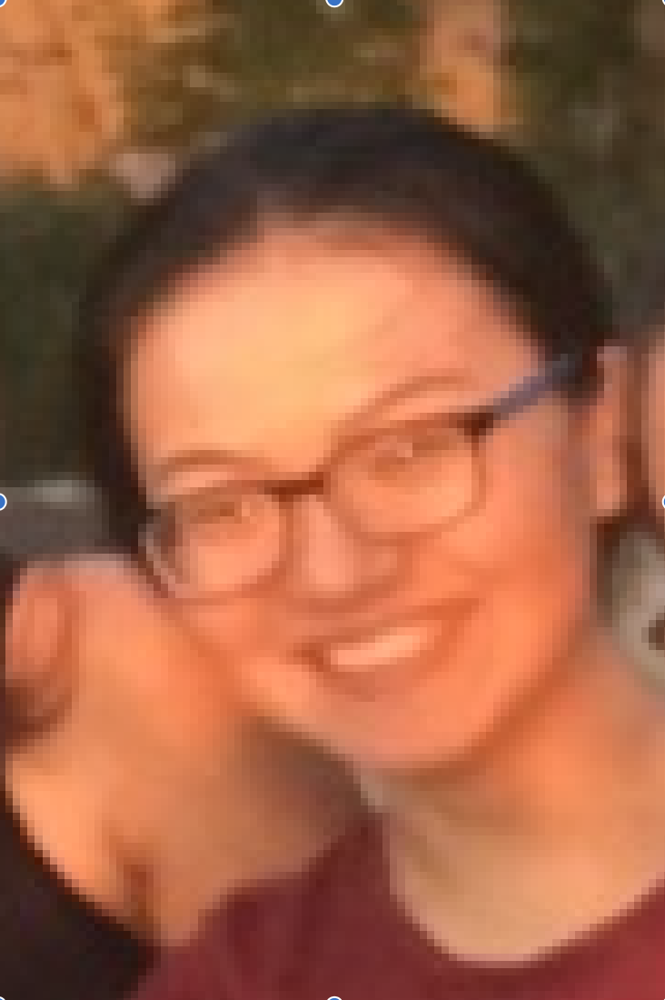{: width="110"}

**Qiaoqian Hu**, MS 2018

