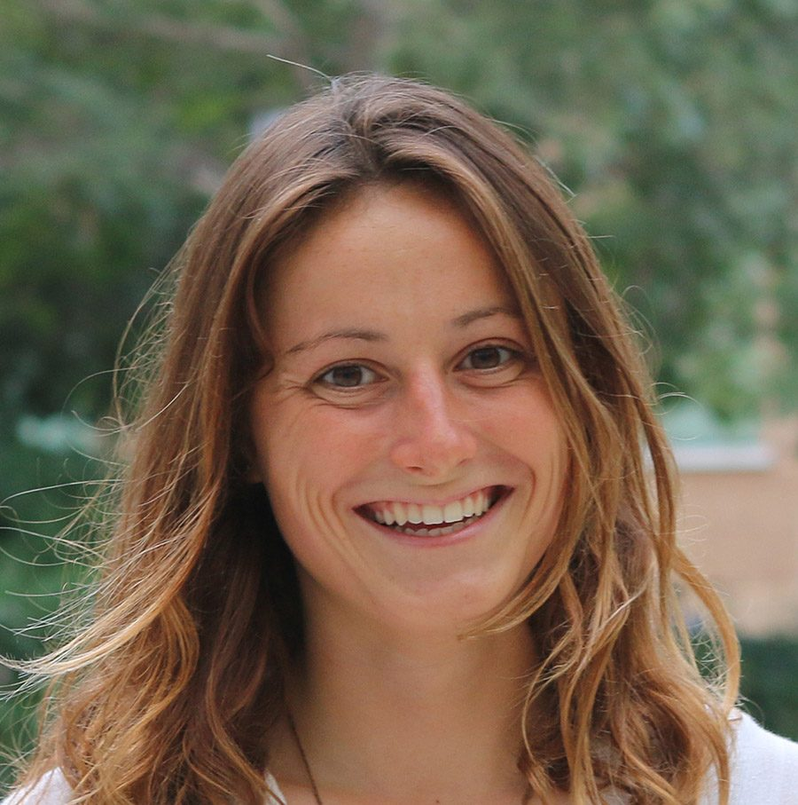
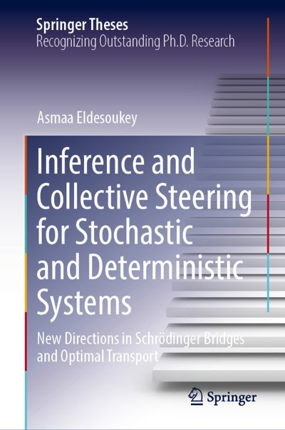
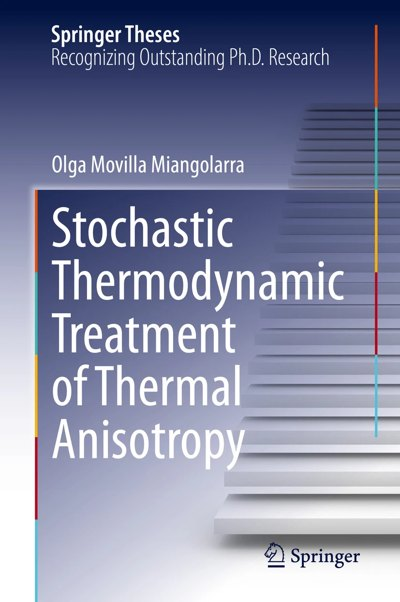
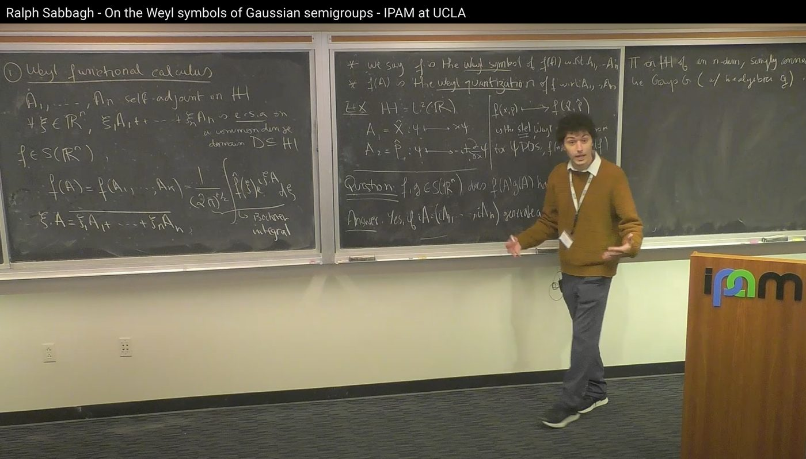
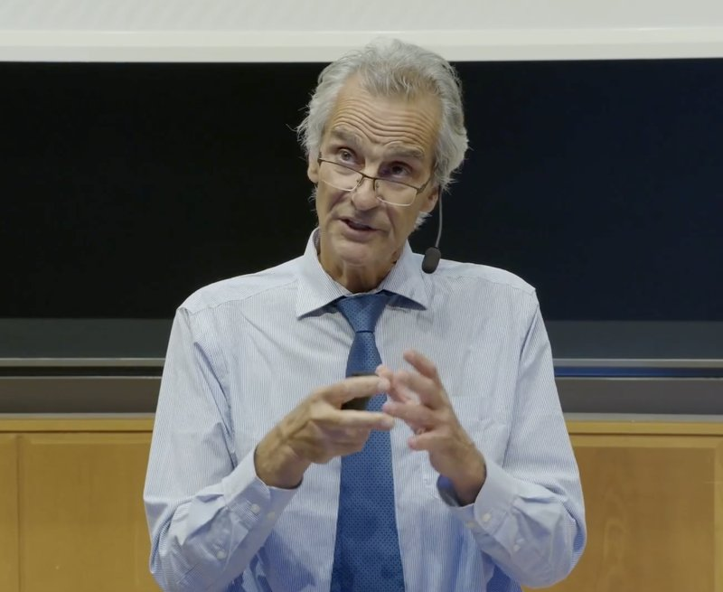

# Featured

{: width="200"}

**[Ilya Prigogine Prize in Thermodynamics - May 2025](https://quantum-thermodynamics.unibs.it/PrigoginePrize/PrigoginePrize.htm)**\\
Recipient: Olga Movilla Miangolarra\\
[In the News!](https://engineering.uci.edu/news/2025/6/engineering-alum-receives-prigogine-prize-thermodynamics)

[{: width="130"}](https://link.springer.com/book/9783032436603)

**Springer Theses:**\\
Recognizing Outstanding Ph.D. Research\\
Asmaa Eldesoukey\\
[*Inference and Collective Steering for Stochastic and Deterministic Systems: New Directions in Schrödinger Bridges and Optimal Transport*](https://link.springer.com/book/9783032436603)

[{: width="130"}](https://link.springer.com/book/10.1007/978-3-031-68066-3)

**Springer Theses:**\\
Recognizing Outstanding Ph.D. Research\\
Olga Movilla Miangolarra\\
[*Stochastic Thermodynamic Treatment of Thermal Anisotropy*](https://link.springer.com/book/10.1007/978-3-031-68066-3)

{: width="200"}

**[Ralph Sabbagh - On the Weyl symbols of Gaussian semigroups - IPAM at UCLA](https://www.youtube.com/watch?v=AJNVneruyNw)**\\
Ralph's master class!! at IPAM

[{: width="200"}](https://www.youtube.com/watch?v=2dYB9_sNF_U)

**Tryphon T. Georgiou: [Stochastic Control Meets Non-Equilibrium Thermodynamics](https://www.youtube.com/watch?v=2dYB9_sNF_U)**\\
Plenary lecture, 22nd European Control Conference (ECC 2024), Stockholm

