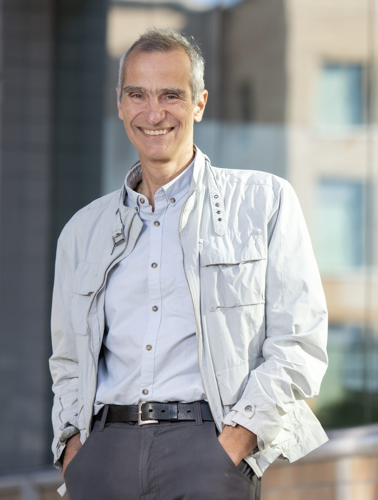

# Tryphon T. Georgiou

Distinguished Professor\\
[Department of Mechanical & Aerospace Engineering](https://engineering.uci.edu/dept/mae)\\
[University of California, Irvine](https://uci.edu)\\
4200 Engineering Gateway Building\\
Irvine, CA 92697-3975\\
tryphon@uci.edu\\
[faculty website](https://engineering.uci.edu/users/tryphon-georgiou)

## Featured

- [Olga wins the Prigogine Prize in Thermodynamics](https://engineering.uci.edu/news/2025/6/engineering-alum-receives-prigogine-prize-thermodynamics)
- [Ralph's master class at IPAM - Weyl symbols of Gaussian semigroups](https://www.youtube.com/watch?v=AJNVneruyNw)

## Quick links

- [Students & postdocs](students.html)
- [Brief bio](bio.html)
- [Publications](publications.html)
- [Anteater Racing](formularacing.html)
